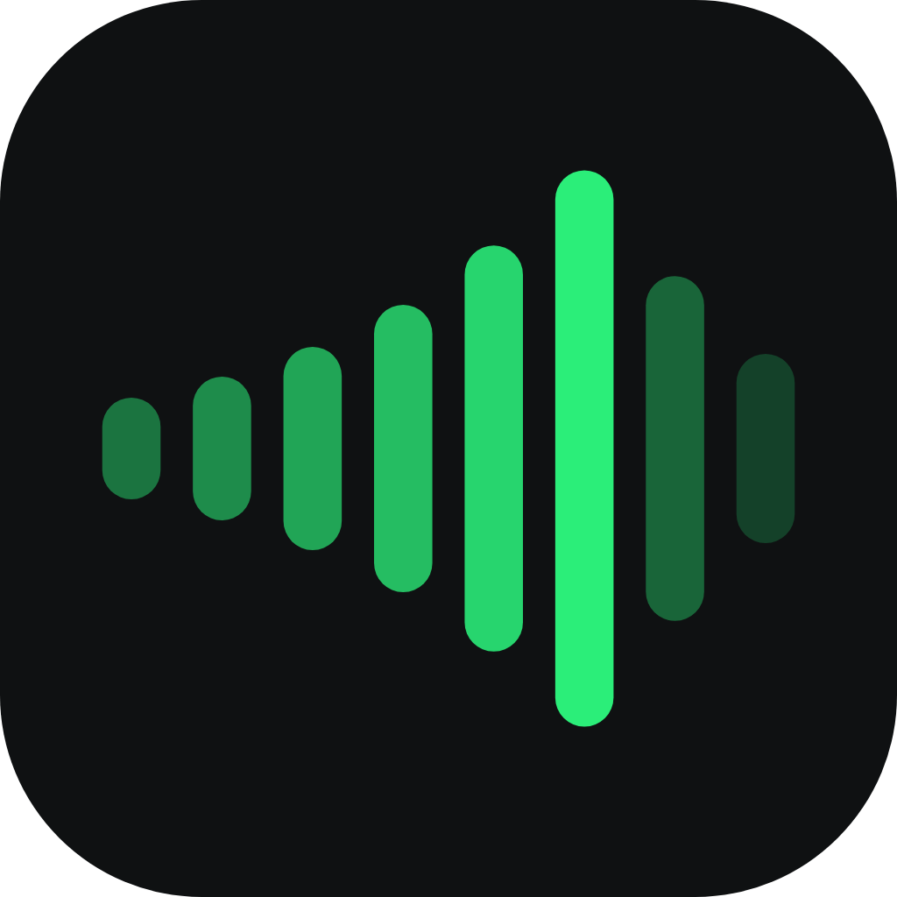

  
  ECOS

**Adivina la canción del día escuchando solo unos segundos.**  
Música en español y latina · Un reto nuevo cada día para todos

 

---

## Sobre el proyecto

ECOS es un **proyecto personal** que desarrollo **por afición**: un pequeño juego web para disfrutar de la música, retar el oído y, si te apetece, competir en un ranking con buen rollo. No es un producto comercial; es código y diseño hechos con ganas de aprender y compartir.

---

## Qué puedes hacer en la app

| | |
|:---:|:---|
| **Reto diario** | Cada día, la misma canción para todo el mundo. |
| **Pistas de audio** | Varios intentos; en cada uno escuchas un poco más de la canción. Puedes saltar intentos. |
| **Puntos** | Cuanto antes aciertes, mayor puntuación. |
| **Rankings** | Listado **global**, **semanal** y **mensual**, además **historial** de retos pasados. |
| **Perfil** | Cuenta opcional, estadísticas y cómo te muestras en las tablas. |
| **PWA** | Úsalo en el móvil e **instálalo** como app desde el navegador. |
| **Idiomas** | Interfaz en **español** e **inglés**. |
| **Feedback** | Envía sugerencias o **reporta** si algo no suena bien en un reto. |

---

## Cómo se juega (resumen)

Escribes título o artista y eliges entre las coincidencias. Tienes hasta **seis intentos**; en cada uno el audio crece hasta unos **30 segundos**.

---

## Stack tecnológico

Visión general.

### Núcleo

| Capa | Tecnología |
|------|------------|
| **Framework** | [Next.js](https://nextjs.org) 16 (App Router) · [React](https://react.dev) 19 |
| **Lenguaje** | [TypeScript](https://www.typescriptlang.org) |
| **Backend / datos** | [Supabase](https://supabase.com) — PostgreSQL, autenticación y almacenamiento |
| **Estilos** | [Tailwind CSS](https://tailwindcss.com) v4 · [shadcn/ui](https://ui.shadcn.com) (Radix) |

### Frontend y experiencia

| Área | Herramientas |
|------|----------------|
| **Estado y datos en cliente** | [Zustand](https://github.com/pmndrs/zustand) · [TanStack Query](https://tanstack.com/query) v5 (con persistencia opcional) |
| **Formularios y validación** | [React Hook Form](https://react-hook-form.com) · [Zod](https://zod.dev) |
| **Audio** | [Howler.js](https://howlerjs.com) |
| **Animación** | [Framer Motion](https://www.framer.com/motion/) |
| **Tema** | [next-themes](https://github.com/pacocoursey/next-themes) (claro / oscuro) |
| **i18n** | [next-intl](https://next-intl-docs.vercel.app) |
| **PWA** | [Serwist](https://serwist.pages.dev) (service worker, página offline) |

---

*Proyecto hobby · Hecho con ❤️, música y código*

