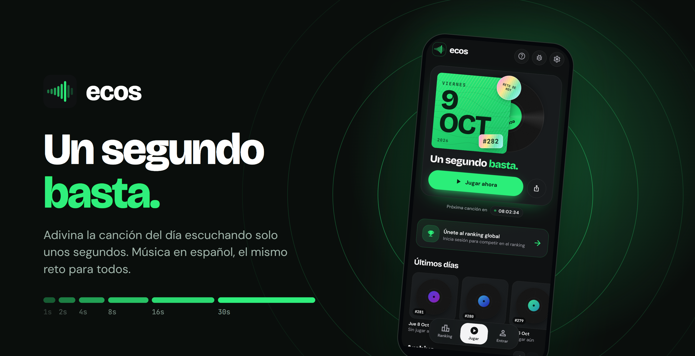
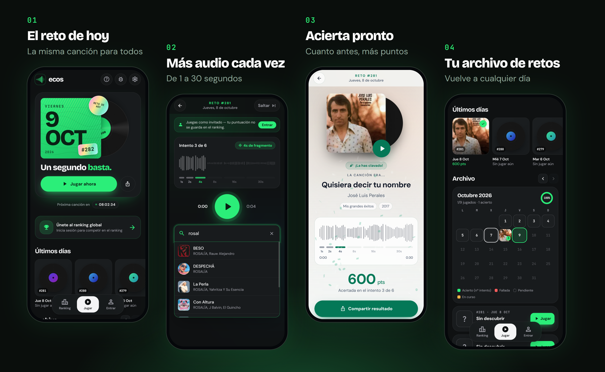

<div align="center">
  
  <p>
    <a href="https://ecosgame.vercel.app"><strong>Jugar a Ecos →</strong></a>
  </p>
  <p>
    
    
    
  </p>
</div>

---

## Qué es Ecos

Cada día hay una canción misteriosa, la misma para todo el mundo. Escuchas **un segundo**, y si no la reconoces, otro poco más, hasta seis intentos y unos 30 segundos como máximo. Cuanto antes aciertes, más puntos te llevas.

Es un **proyecto personal** hecho por afición: un pequeño juego para disfrutar de la música en español, retar el oído y, si te apetece, competir en un ranking con buen rollo.

## Qué puedes hacer



### 🎧 Adivinar con pistas de audio
Seis intentos, y en cada uno escuchas un fragmento más largo (1, 2, 4, 8, 16 y 30 segundos). Escribe título o artista, elige entre las coincidencias —la búsqueda ignora acentos— o salta el intento si no te suena.

### 🏆 Competir en el ranking
Cuanto antes aciertes, mayor puntuación. Hay clasificación **global**, **semanal** y **mensual**, con un historial de quién ganó cada semana y cada mes. El ranking se actualiza en tiempo real cuando alguien termina su partida.

### 🗓️ Volver a cualquier día
Un archivo con todos los retos pasados: los que acertaste, los que fallaste y los que te quedan pendientes. Si no tienes cuenta, puedes jugar igualmente como invitado; solo que no puntúas.

### 👤 Tu perfil
Cuenta opcional con Google, estadísticas personales y cómo te muestras en las tablas.

### ✨ Y los detalles
- **Instalable** como app desde el navegador, con pantalla propia si te quedas sin conexión.
- **Tema claro y oscuro**, en **español e inglés**.
- **Avisos diarios** opcionales con una notificación push.
- **Feedback** y reportes si algo no suena bien en un reto.

## Instalación como app

Ecos es una PWA: ábrela en el navegador y elige **«Instalar»** (escritorio y Android) o **«Añadir a pantalla de inicio»** (iOS).

## Hecho con

Next.js 16 · React 19 · TypeScript · Tailwind CSS v4 · Supabase · Vercel

Las canciones las elige cada día un script de Python que se ejecuta con GitHub Actions; el audio llega al cliente a través de un proxy propio.

## Desarrollo

```bash
pnpm install
pnpm dev          # http://localhost:3000
```

Hace falta un `.env.local` con las claves de Supabase y de Google (los nombres están en
[`CLAUDE.md`](CLAUDE.md)). No hay tests: antes de dar algo por bueno se pasan `pnpm lint`,
`pnpm typecheck` y `pnpm build`, que es también lo que ejecuta la integración continua.

La base de datos se comparte con otra aplicación; el esquema de Ecos está versionado en
[`supabase/schema/`](supabase/schema/README.md). Las reglas de trabajo, la arquitectura y las trampas
conocidas están en [`CLAUDE.md`](CLAUDE.md).

---

<div align="center">

*Proyecto hobby · Hecho con ❤️, música y código*

</div>
